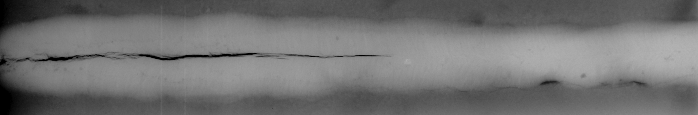
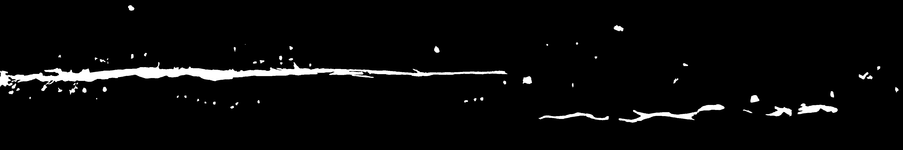
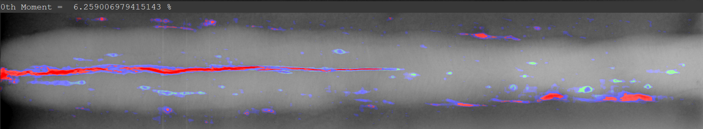

# Detecting Welding Defects in Steel Plates using Computer Vision Algorithms

In practice, it is practically impossible to obtain a perfect weld and, in most circumstances, it is not necessary to provide the adequate service functions required. However early detection and segregation is always preferred to mishaps.

Using our algorithms, we can easily detect faults in welding by the images and also measure the severity of each fault precisely. This will further help in faster image recognition and avoid adverse situations from arising. It was found, using Convolutional Neural Networks algorithm and U-Net architecture making the process much more efficient. Resulting in an accuracy of 98.3% by the end of the work.

The following is one such sample:

### Raw Input:

### Ground Truth:

### Sample Output:

